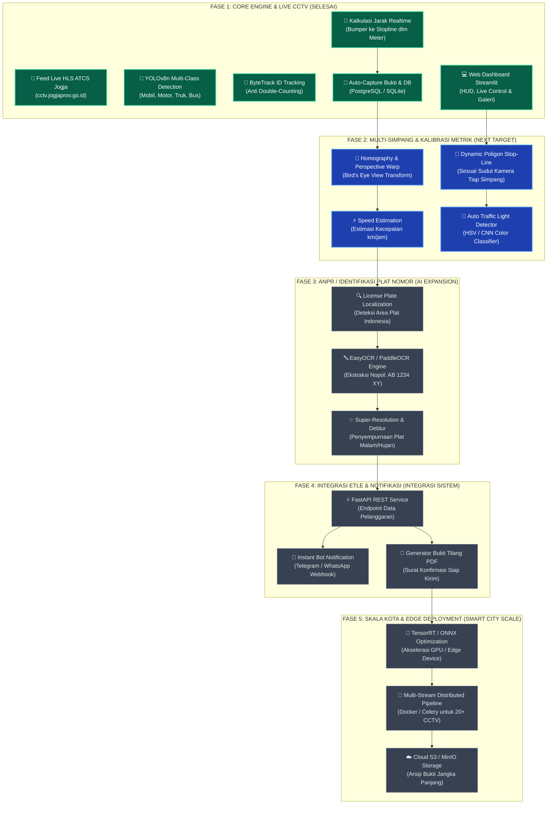
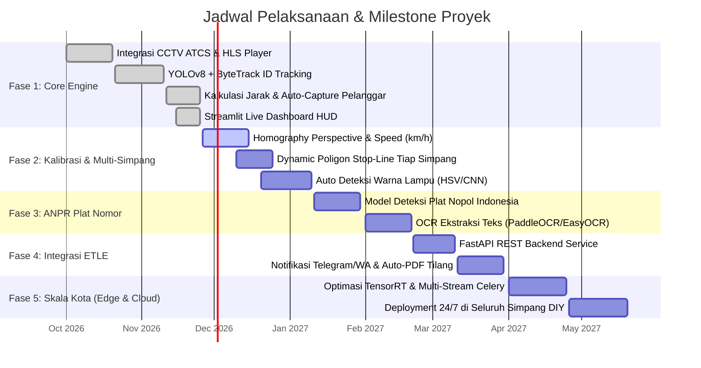

# 🚦 Visual Roadmap: Traffic Light Violation Detection System

**Yogyakarta Smart City & ATCS Edition**

---

## 🗺️ Master Architecture & Roadmap Diagram

```mermaid
graph TD
    %% Styling Definisi
    classDef done fill:#065f46,stroke:#34d399,stroke-width:2px,color:#fff;
    classDef current fill:#1e40af,stroke:#60a5fa,stroke-width:2px,color:#fff;
    classDef future fill:#374151,stroke:#9ca3af,stroke-width:1px,color:#e5e7eb;
    classDef milestone fill:#7c2d12,stroke:#f87171,stroke-width:2px,color:#fff;

    %% FASE 1
    subgraph F1["FASE 1: CORE ENGINE & LIVE CCTV (SELESAI)"]
        F1_1["📡 Feed Live HLS ATCS Jogja<br/>(cctv.jogjaprov.go.id)"]:::done
        F1_2["🧠 YOLOv8n Multi-Class Detection<br/>(Mobil, Motor, Truk, Bus)"]:::done
        F1_3["🎯 ByteTrack ID Tracking<br/>(Anti Double-Counting)"]:::done
        F1_4["📏 Kalkulasi Jarak Realtime<br/>(Bumper ke Stopline dlm Meter)"]:::done
        F1_5["📸 Auto-Capture Bukti & DB<br/>(PostgreSQL / SQLite)"]:::done
        F1_6["💻 Web Dashboard Streamlit<br/>(HUD, Live Control & Galeri)"]:::done
    end

    %% FASE 2
    subgraph F2["FASE 2: MULTI-SIMPANG & KALIBRASI METRIK (NEXT TARGET)"]
        F2_1["📐 Homography & Perspective Warp<br/>(Bird's Eye View Transform)"]:::current
        F2_2["⚡ Speed Estimation<br/>(Estimasi Kecepatan km/jam)"]:::current
        F2_3["🛑 Dynamic Poligon Stop-Line<br/>(Sesuai Sudut Kamera Tiap Simpang)"]:::current
        F2_4["🚦 Auto Traffic Light Detector<br/>(HSV / CNN Color Classifier)"]:::current
    end

    %% FASE 3
    subgraph F3["FASE 3: ANPR / IDENTIFIKASI PLAT NOMOR (AI EXPANSION)"]
        F3_1["🔍 License Plate Localization<br/>(Deteksi Area Plat Indonesia)"]:::future
        F3_2["🔤 EasyOCR / PaddleOCR Engine<br/>(Ekstraksi Nopol: AB 1234 XY)"]:::future
        F3_3["✨ Super-Resolution & Deblur<br/>(Penyempurnaan Plat Malam/Hujan)"]:::future
    end

    %% FASE 4
    subgraph F4["FASE 4: INTEGRASI ETLE & NOTIFIKASI (INTEGRASI SISTEM)"]
        F4_1["⚡ FastAPI REST Service<br/>(Endpoint Data Pelanggaran)"]:::future
        F4_2["📲 Instant Bot Notification<br/>(Telegram / WhatsApp Webhook)"]:::future
        F4_3["📄 Generator Bukti Tilang PDF<br/>(Surat Konfirmasi Siap Kirim)"]:::future
    end

    %% FASE 5
    subgraph F5["FASE 5: SKALA KOTA & EDGE DEPLOYMENT (SMART CITY SCALE)"]
        F5_1["🚀 TensorRT / ONNX Optimization<br/>(Akselerasi GPU / Edge Device)"]:::future
        F5_2["🔄 Multi-Stream Distributed Pipeline<br/>(Docker / Celery untuk 20+ CCTV)"]:::future
        F5_3["☁️ Cloud S3 / MinIO Storage<br/>(Arsip Bukti Jangka Panjang)"]:::future
    end

    %% Relasi Alur Antar Fase
    F1_4 --> F1_5
    F1_5 --> F2_1
    F1_6 --> F2_3

    F2_1 --> F2_2
    F2_2 --> F3_1
    F2_3 --> F2_4

    F3_1 --> F3_2
    F3_2 --> F3_3
    F3_3 --> F4_1

    F4_1 --> F4_2
    F4_1 --> F4_3
    F4_3 --> F5_1

    F5_1 --> F5_2
    F5_2 --> F5_3
```

---

## ⏱️ Timeline & Status Eksekusi

```mermaid
gantt
    title Jadwal Pelaksanaan & Milestone Proyek
    dateFormat  YYYY-MM-DD
    axisFormat  %b %Y

    section Fase 1: Core Engine
    Integrasi CCTV ATCS & HLS Player          :done, f1_1, 2026-10-01, 2026-10-20
    YOLOv8 + ByteTrack ID Tracking             :done, f1_2, 2026-10-21, 2026-11-10
    Kalkulasi Jarak & Auto-Capture Pelanggar   :done, f1_3, 2026-11-11, 2026-11-25
    Streamlit Live Dashboard HUD              :done, f1_4, 2026-11-15, 2026-11-25

    section Fase 2: Kalibrasi & Multi-Simpang
    Homography Perspective & Speed (km/h)      :active, f2_1, 2026-11-26, 2026-12-15
    Dynamic Poligon Stop-Line Tiap Simpang    :f2_2, 2026-12-10, 2026-12-25
    Auto Deteksi Warna Lampu (HSV/CNN)         :f2_3, 2026-12-20, 2027-01-10

    section Fase 3: ANPR Plat Nomor
    Model Deteksi Plat Nopol Indonesia         :f3_1, 2027-01-11, 2027-01-30
    OCR Ekstraksi Teks (PaddleOCR/EasyOCR)     :f3_2, 2027-02-01, 2027-02-20

    section Fase 4: Integrasi ETLE
    FastAPI REST Backend Service               :f4_1, 2027-02-21, 2027-03-10
    Notifikasi Telegram/WA & Auto-PDF Tilang   :f4_2, 2027-03-11, 2027-03-30

    section Fase 5: Skala Kota (Edge & Cloud)
    Optimasi TensorRT & Multi-Stream Celery    :f5_1, 2027-04-01, 2027-04-25
    Deployment 24/7 di Seluruh Simpang DIY     :f5_2, 2027-04-26, 2027-05-20
```
